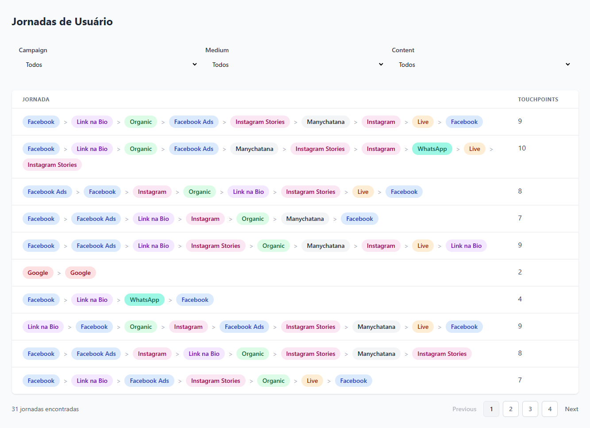

# Teste Técnico Nemu - Processamento de Jornadas de Usuário

Esta aplicação full-stack processa, agrupa e visualiza jornadas de usuário a partir de dados brutos, oferecendo uma experiência fluida e moderna.
A solução é composta por:

- Backend: API RESTful em Node.js.
- Frontend: Interface interativa em React.
- Ambiente: Totalmente containerizado com Docker para um setup simples e consistente.

## 🚀 Prévia da Aplicação



## ✨ Funcionalidades Principais

### Backend (Node.js API)

API RESTful: Desenvolvida com Node.js, TypeScript e Express.

Leitura de Dados: Processa jornadas de usuário a partir de arquivos .xlsx.

Lógica de Negócio: Aplica regras para limpar e normalizar jornadas, incluindo deduplicação de canais intermediários.

Definição de Canais: Deriva canais de marketing (ex.: Facebook Ads, Google Organic) a partir de parâmetros UTM (utm_source, utm_medium, utm_campaign).

Endpoint de Jornadas: Expõe os dados processados via GET /journeys.

### Frontend (React.js)

Interface Interativa: Construída com React, Vite e Typescript.

Estilização Moderna: Utiliza Tailwind CSS para uma UI limpa e responsiva.

Visualização de Jornadas: Exibe jornadas em uma tabela clara, com "pílulas" coloridas para identificar canais.

Paginação: Sistema completo para navegação em grandes volumes de dados.

Filtragem Dinâmica: Permite filtrar jornadas em tempo real por Campanha, Meio e Conteúdo.

### 🛠️ Tecnologias Utilizadas

Backend: Node.js, TypeScript, Express, xlsx

Frontend: React, Vite, TypeScript, Tailwind CSS, Axios

Ambiente: Docker, Docker Compose

### 📋 Pré-requisitos

Para rodar o projeto, você precisa ter instalado:

Docker
Docker Compose (geralmente incluído no Docker Desktop)

### ⚡ Como Executar o Projeto

O setup é simplificado com Docker. Siga os passos abaixo:

Clone o repositório:

```
git clone https://github.com/seu-usuario/teste-nemu.git
```

Navegue até a pasta do projeto:

```
cd teste-nemu
```

Suba os containers com Docker Compose:

```
docker compose up --build
```

O parâmetro `--build` garante que as imagens Docker sejam construídas do zero na primeira execução.

## Acesse a aplicação:

Frontend: http://localhost:5173
Backend API: http://localhost:3333

## Parar os serviços:

Pressione `Ctrl + C` no terminal onde o docker compose está rodando.
Ou execute docker compose down em outro terminal.

## 🔗 Documentação da API

### Endpoint Principal

GET /journeys

Descrição: Retorna um array com todas as jornadas de usuário processadas.

### Estrutura da Resposta

```
[
  {
    "sessionId": "some_unique_session_id",
    "touchPoints": [
      {
        "utm_source": "facebook",
        "utm_medium": "cpc",
        "utm_campaign": "...",
        "utm_content": "...",
        "createdAt": "2025-05-01T00:03:54.000Z",
        "channel": "Facebook Ads"
      }
    ],
    "touchPointCount": 4,
    "channels": ["Facebook Ads", "Link na Bio", "Organic", "Facebook Ads"]
  }
]
```

### 🧠 Decisões de Design e Arquitetura

### Definição de Canais

Como a coluna channel não existia nos dados brutos, implementei uma função no backend para derivar canais de marketing descritivos (ex.: Instagram Stories, WhatsApp, Google Organic) com base nos parâmetros UTM.
A lógica foi refinada iterativamente para cobrir padrões variados, como insta, stories e outros termos não padronizados.

### Agrupamento vs. Filtragem

Para o requisito de "agrupamento", optei por uma funcionalidade de filtragem interativa. Isso permite isolar jornadas específicas em tempo real, oferecendo valor imediato para exploração de dados.
Uma visão agregada (ex.: contagem de jornadas por campanha) seria um próximo passo interessante para um dashboard analítico, mas a filtragem é a base fundamental para análise inicial.
